## Vary M and N to plot the time taken for: 
1) learning the tree

    - **Real input Real output**

        - Iterating over number of samples
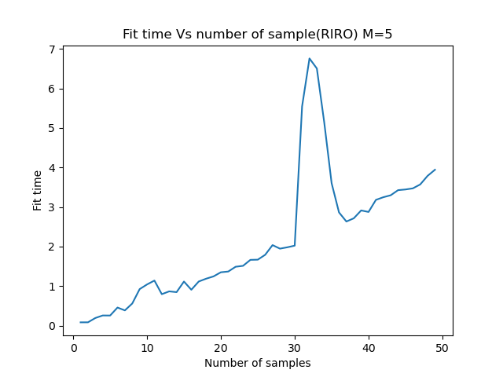

        - Iterating over number of features
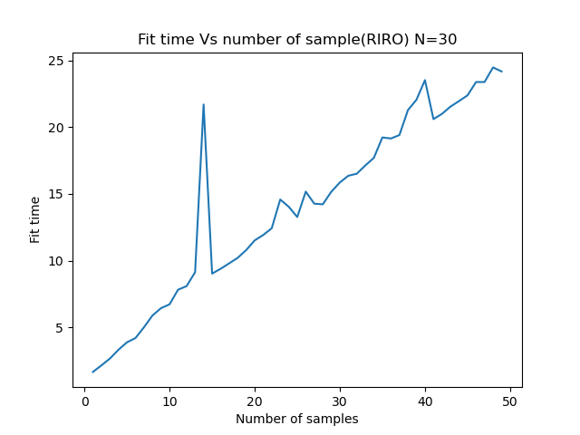

            

    - **Real input discrete output**

        - Iterating over number of samples          

        - Iterating over number of features     
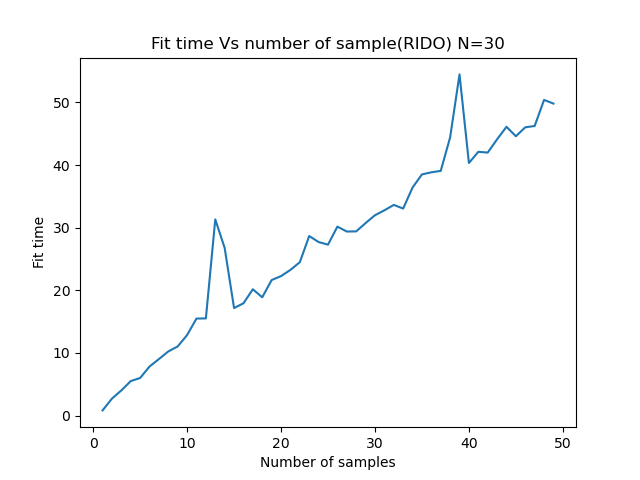

    
    - **Discrete input discrete output**

        - Iterating over number of samples
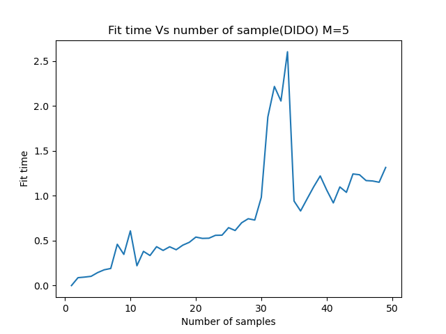

        - Iterating over number of features
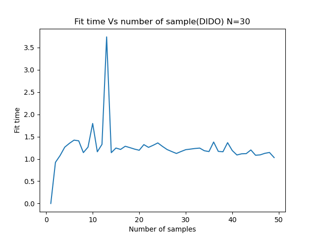

    - **Discrete input real output**

        - Iterating over number of samples
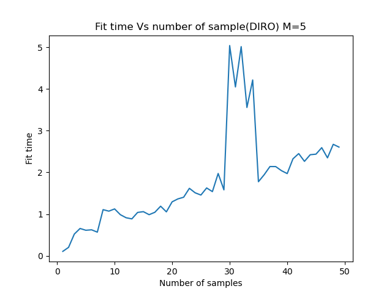

        - Iterating over number of features
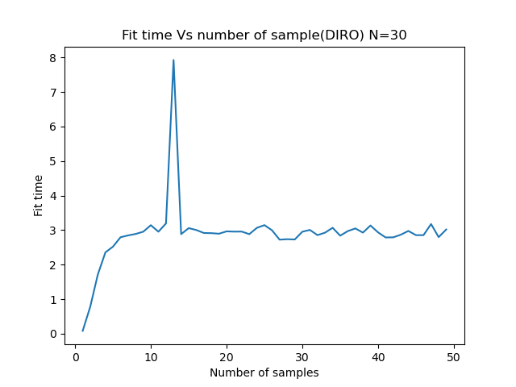

1) learning the tree

    - **Real input Real output**

        - Iterating over number of samples
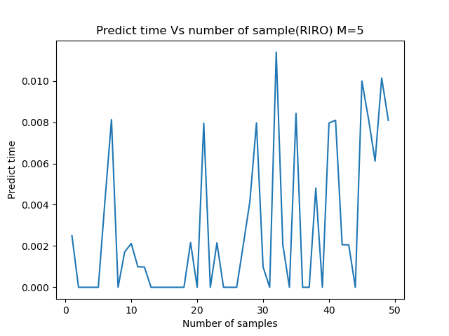

        - Iterating over number of features
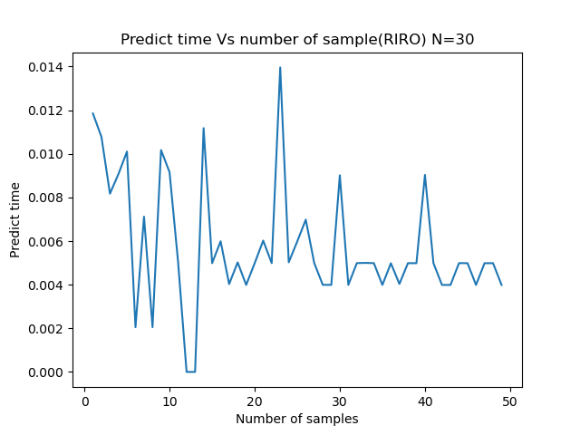

            

    - **Real input discrete output**

        - Iterating over number of samples
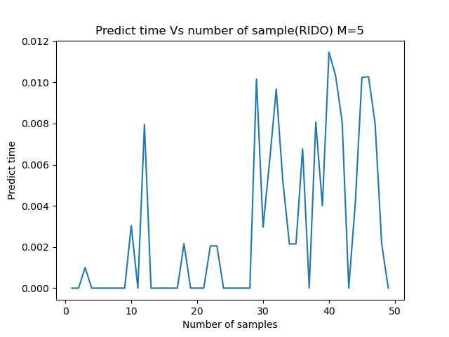

        - Iterating over number of features
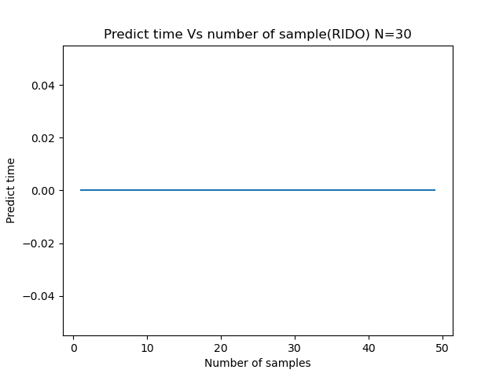

    
    - **Discrete input discrete output**

        - Iterating over number of samples
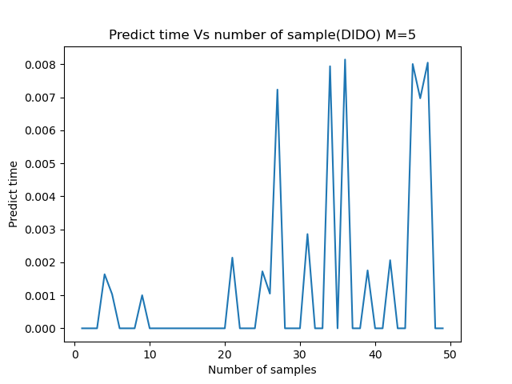

        - Iterating over number of features
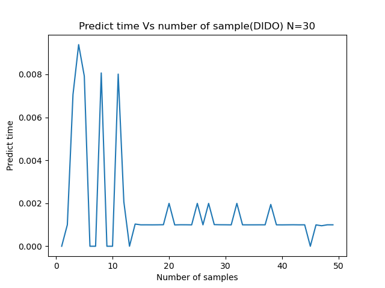

    - **Discrete input real output**

        - Iterating over number of samples
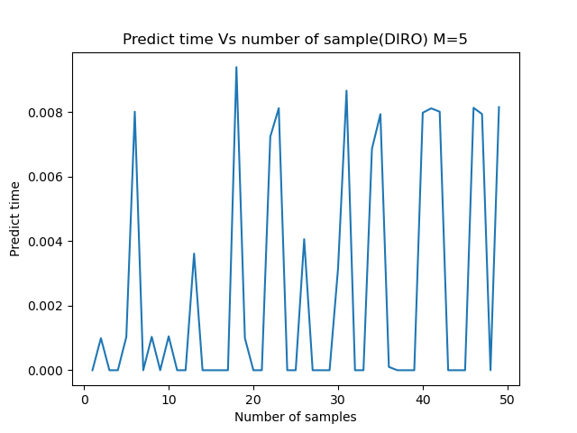

        - Iterating over number of features
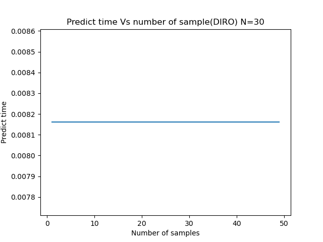

## How do these results compare with theoretical time complexity for decision tree creation and prediction. You should do the comparison for all the four cases of decision trees. 

Theoretically time coplexity for fitting is O(mnlog(n)) where m is number of features and n is number of samples. So as value of m and n increases there will be increase in time. This is visible through above plots.Some curve is visible due to log(n) part.As we are finding best splits hence there may be peaks in between.

Theoretically time coplexity for predicting is O(log(n)) n is number of samples. This must be between linearly increasing and constant time complexity. As we are finding best splits hence there may be peaks in between.

