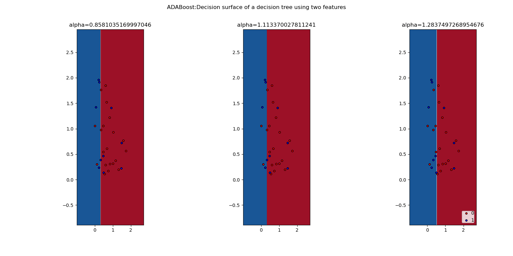
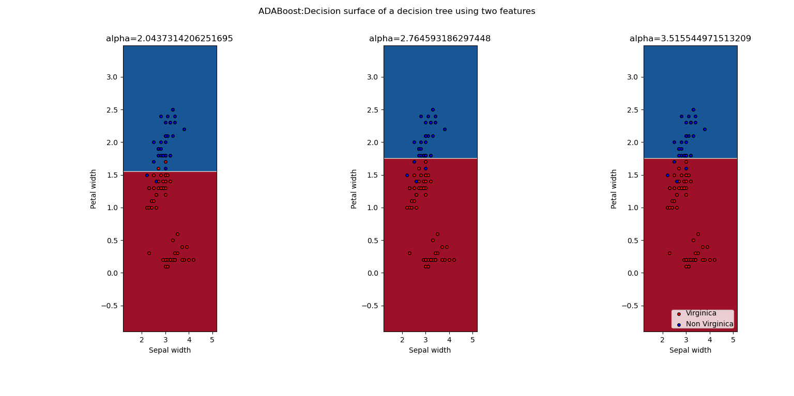
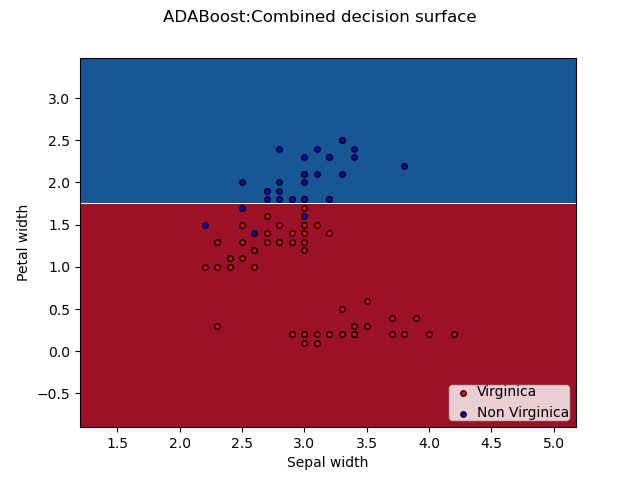

- Adaboost implement on sklearn decision tree of depth 1 for 2 classes

    - Accuracy:  76.66666666666667
    - Precision:  1.0
    - Recall:  1.0
    - Precision:  1.0
    - Recall:  1.0

    **Decision surface of individual estimator**
    

    **Decision surface of combined estimator**
    

- Adaboost implemented on sklearn decision tree of depth 1 on     iris dataset with 3 estimators for 2 classes

    - Accuracy:  98.33333333333333
    - Precision:  1.0
    - Recall:  1.0
    - Precision:  1.0
    - Recall:  1.0

    **Decision surface of individual estimator**
    

    **Decision surface of combined estimator**
    

- sklearn decision tree of depth 1 on     iris dataset for 2 classes

    - Accuracy:  95.0
    - Precision:  1.0
    - Recall:  1.0
    - Precision:  1.0
    - Recall:  1.0

Comparing decision tree without and with adaboost with 3 estimator we can clearly see rise in accuracy from 95% to 98%.

