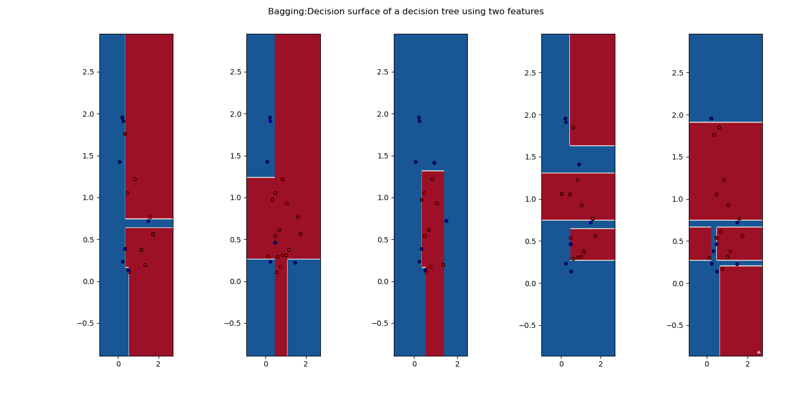

- Bagging implemented on sklearn decision tree using 2 features for 2 classes

    - Accuracy:  90
    - Precision:  1.0
    - Recall:  1.0
    - Precision:  1.0
    - Recall:  1.0

    **Decision surface of individual estimator**
    
    

    **Decision surface of combined estimator**
    
    

