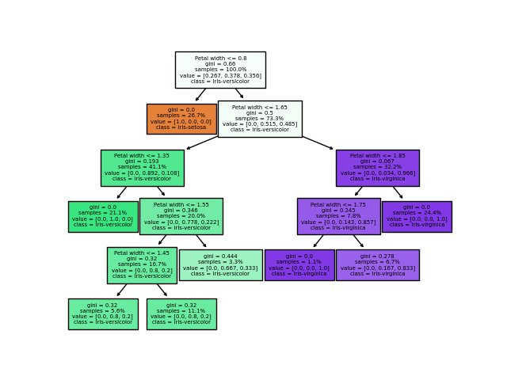
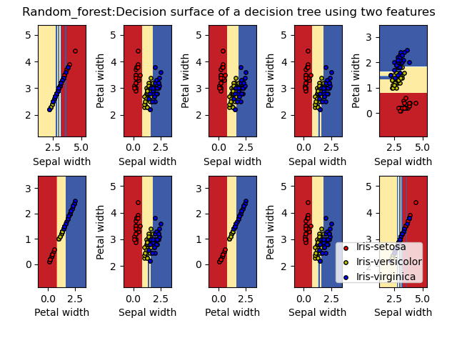
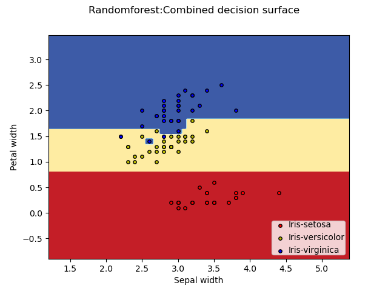

**RandomForestClassifier()**
- Criteria:- Information gain
    - Accuracy:  86.66666666666667

    Class 1
    - Precision:  1.0 
    - Recall:  1.0   

    Class 2
    - Precision:  1.0
    - Recall:  1.0

    Class 3   
    - Precision:  1.0
    - Recall:  1.0

    Class 4

    - Precision:  1.0
    - Recall:  1.0

    Class 5

    - Precision:  1.0
    - Recall:  1.0

- Criteria:- Gini index
    - Accuracy:  93.33333333333333

    Class 1
    - Precision:  1.0 
    - Recall:  1.0   

    Class 2
    - Precision:  1.0
    - Recall:  1.0

    Class 3   
    - Precision:  1.0
    - Recall:  1.0

    Class 4

    - Precision:  1.0
    - Recall:  1.0
    
    Class 5

    - Precision:  1.0
    - Recall:  1.0

**RandomForestRegressor()**
- Criteria : gini_index
    - RMSE:  1.3419780147841834e-16
    - MAE:  7.748431526029738e-17

Generate the plots for Iris data set. Fix a random seed of 42. Shuffle the dataset according to this random seed. Use the first 60% of the data for training and last 40% of the data set for testing. Using sepal width and petal width as the two features. Include you code in `random_forest_iris.py`

**RandomForestClassifier on iris dataset**

- Accuracy:  96.66666666666667

- Precision Per class:-
    - Iris-setosa:-1
    - Iris-versicolor:-1
    - Iris-virginica:-1
- Recall Per class:-
    - Iris-setosa:-1
    - Iris-versicolor:-1
    - Iris-virginica:-1

**Some learnt trees among 10 models**

*Tree classifying using one feature*

*Tree classifying using two feature*

**Decision surface of individual estimator**

**Decision surface of combined estimator**

