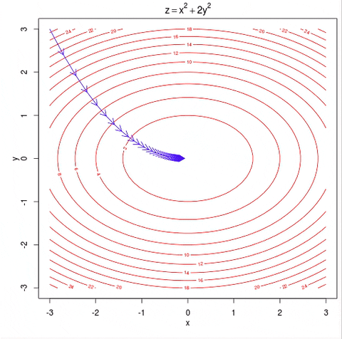

# Assignment - Linear Regression 
1. Solve linear regression via gradient descent for ‘d’ dimensional input and N samples using individual parameter updates
(theta_i's) in a non-vectorised setting.\
  Method should include: \
    a. learning rate, default: 0.01 \
    b. number of iterations (default: 100) \
    c. Learning rate function over time: \
      (i) ‘Constant’: (default)learning rate does not change over time \
      (ii) ‘Inverse’: learning rate is alpha/t where t is the iteration number \
    d. Batch_size (setting it to 1 converts to SGD, setting to some number between 1 and N converts to mini-batch GD. 
     Edit `linearRegression/linearRegression.py (fit_non_vectorised())` [3 marks]
  
2. Solve the above using gradient descent in vectorised form with all the same set of parameters. Edit `linearRegression/linearRegression.py (fit_vectorised())` [2 marks]

3. Write a function to learn the regression coefficients using gradient descent. Instead of writing the formulae for computing gradients by yourself, you will use Autograd to automatically do that for you. All other parameters remain the same. 
Autograd reference: https://github.com/HIPS/autograd. Edit `linearRegression/linearRegression.py (fit_autograd())` [1 mark]


4. Write a function inspired by sklearn’s polynomial preprocessing: (https://scikit-learn.org/stable/modules/generated/sklearn.preprocessing.PolynomialFeatures.html) your function should have: degree and include bias parameters only. For this assignment, assume that input is a 1-dimensional numpy array.  For example, if an input sample is  np.array([a, b]), the degree-2 polynomial features with "include_bias=True" are [1, a, b, a<sup>2</sup>, b<sup>2</sup>].Edit
`preprocessing/polynomial_features` [1 mark]

5. Create a data set as follows: 
```python
x = np.array([i*np.pi/180 for i in range(60,300,4)]) 
np.random.seed(10) #Setting seed for reproducibility 
y = 4*x + 7 + np.random.normal(0,3,len(x)) 
```
Now, using your newly created function for polynomial feature generation above, plot magnitude of theta v/s degree when you fit
linear regression using the polynomial of degree d. What can you conclude? Edit `q5_plot.py` [1 mark] 


6. Now, use the above code and for degree = 1, 3, 5, 7, 9, plot magnitude of theta v/s degree for varying N, where N is the size of
the data set (size of x, and thus y). What can you conclude? Edit `q6_plot.py` [1 mark]


7. For gradient descent (any of the above implementation) create the following three gifs of gradient descent updates.
- the surface plot of RSS in 3D 
- the line fit
- the contour

This needs to be done only for the case of 2 coefficients (theta_0 and theta_1). 
The gifs need to show only the first 10 iterations. 
Examples for first 2 gifs can be found at https://giphy.com/gifs/gradient-O9rcZVmRcEGqI.<br /> 
<br />
Example for last gif can be found at https://giphy.com/gifs/gradient-6QlTwkigqg4yk. <br />
<br />
You can create these gifs using any online services after you plot individual images for each gradient update.
Alternatively you can also use the matplotlib.animation library. Edit`q7_plot.py` [3 marks]


8. Compare time required for gradient descent v/s normal and see if it matches theoretical numbers. Edit `q8_compare_time.py`
[1 mark]

9. Create a data set that suffers from multicollinearity and check if your gradient descent implementation works. Edit
`q9_dataset.py` [1 mark]


Query Doc: TBA