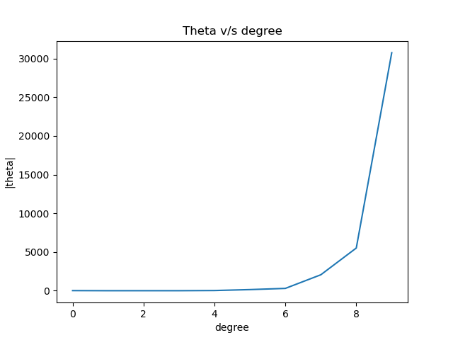

# ES654-2020 Assignment 3

*Hetvi Shastri* - *18110064*

------

- Plot

- Explanation
As the degree increases the magnitude of theta increases. The reason behind this is that when we increase the degree the chances of overfitting increases. Due to this there is an increase in magnitude of theta.

