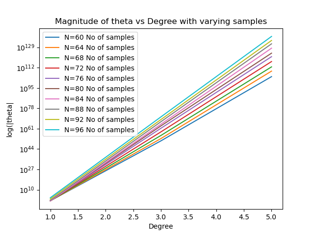

# ES654-2020 Assignment 3

*Hetvi Shastri* - *18110064*

------

- Plot

- Explanation

    As the number of samples increases there is more chance of overfitting which leads to increase in magnitude of coefficient. As seen in previous question as value of degree increases there is increase in value of theta. This statements are justifiable through the above plot.

    I have tried L-1 norm, L-2 norm and L-inf norm the graph has no change.

