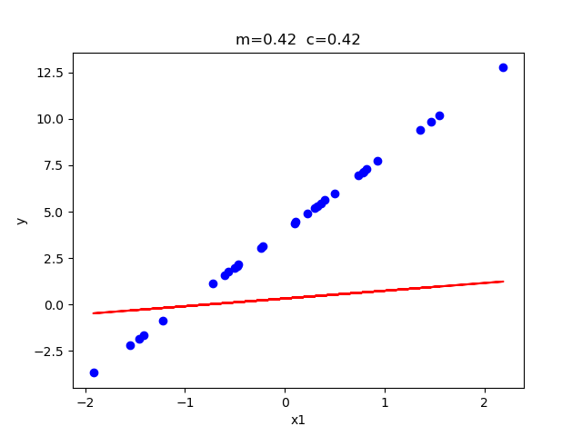

# ES654-2020 Assignment 3

*Hetvi Shastri* - *18110064*

------

Here I have tried to apply linear regression for the points denoted by the equation 4x+4.

Surface plot

It is visible as iterations increases there will decrese in error and the point will tend towards local minima.

Contour plot

It is visible as iterations increases the point will tend towards (4,4) and the speed at which it will tend will decrease.

Line plot

It is visible as iterations increases m and c will tend towards 4. The speed at which it will tend will decrease.
