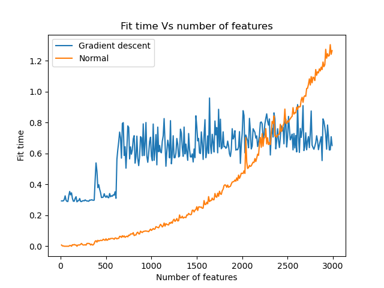
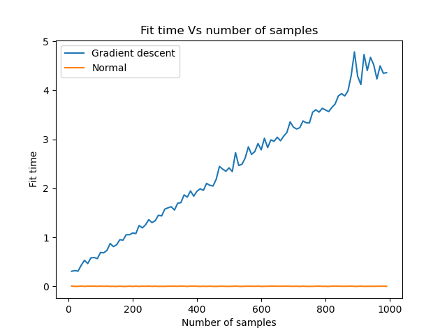
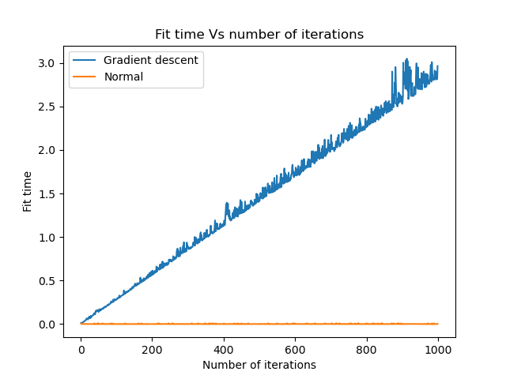

# ES654-2020 Assignment 3

*Hetvi Shastri* - *18110064*

------
- Consider number of features:-D
- Number of samples:-N
- Number of iterations:-t

Theoretical values:- 

- Normal Equation:-O( D3
- Gradient Descent:- O(DNt)

**Fit time Vs varying number of features**

Theoretically, we can see that as fitting time of normal equation is proportionate cubically varying with respect to features. So we can see in graph that it increases cubically as number of features increases.

Theoretically, we can see that as fitting time of gradient descent is varying linearly with respect to features. So we can see in graph that it increases but there is not a significant increase and for less change in number of features it is not visible. There are some spikes.

**Fit time Vs varying number of samples**

Theoretically, we can see that as fitting time of normal equation is not dependent on number of samples. So we can see in graph that it is constant as number of features increases.

Theoretically, we can see that as fitting time of gradient descent is dependent on number of samples linearly. So we can see in graph that it is linealy increasing as features increases.

**Fit time Vs varying number of iterations**

As value of iterations increase time required for normal equation is constant but time required for gradient descent will gradually increase.
